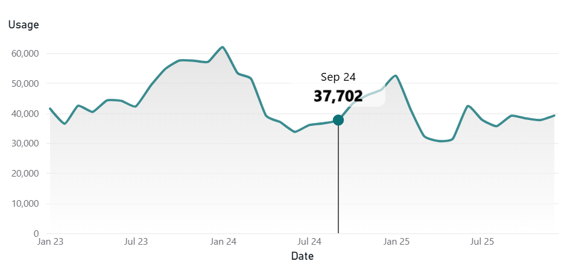

---
hide:
    - toc
    - footer
---

-   __Basic Histogram__

    ---
    

-   __Small Multiples - Day of the Week__

    ---
    

- __Line Chart Brush + Zoom effect__

    ---
    

- __KPI Card Area__

    ---
    

- __Calendar Heatmap with Histogram__

    ---
    

- __Calendar Heatmap with Histogram - Compact version__

    ---
    

- __Hourly Heatmap with Histogram__

    ---
    

- __Hourly Heatmap with Bar charts__

    ---
    

- __Shaded line chart with custom tooltip__

    ---
    
    

