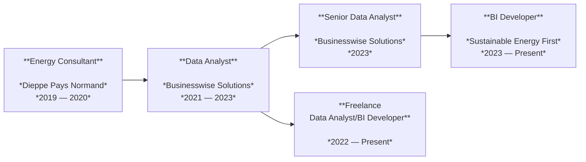

 

Hi, I'm a **BI Developer**, **Data Analyst** and **Power BI** expert.

I build intuitive dashboards and automated reporting solutions that transform complex data into clear, actionable insights. 

I'm a problem solver and insights facilitator at heart, helping businesses make smarter, data-driven decisions.

  <a href="https://github.com/clemviz" target="_blank" class="icon github" aria-label="GitHub">
    <svg role="img" viewBox="0 0 24 24" fill="currentColor">
      <path d="M12 .297a12 12 0 00-3.797 23.4c.6.113.82-.258.82-.577v-2.234c-3.338.726-4.037-1.61-4.037-1.61a3.184 3.184 0 00-1.337-1.756c-1.091-.746.083-.73.083-.73a2.525 2.525 0 011.84 1.236 2.56 2.56 0 003.497 1 2.575 2.575 0 01.764-1.61c-2.665-.305-5.466-1.334-5.466-5.933a4.638 4.638 0 011.235-3.218 4.3 4.3 0 01.118-3.176s1.008-.322 3.3 1.23a11.38 11.38 0 016.003 0c2.28-1.552 3.287-1.23 3.287-1.23a4.3 4.3 0 01.117 3.176 4.63 4.63 0 011.232 3.218c0 4.61-2.807 5.624-5.48 5.92a2.9 2.9 0 01.83 2.24v3.322c0 .325.216.703.825.58A12 12 0 0012 .297z"/>
    </svg>
  </a>

  <a href="https://www.linkedin.com/in/clementvillalard/" target="_blank" class="icon linkedin" aria-label="LinkedIn">
    <svg role="img" viewBox="0 0 24 24" fill="currentColor">
      <path d="M20.447 20.452h-3.554v-5.569c0-1.328-.027-3.037-1.852-3.037-1.853 0-2.136 1.445-2.136 2.939v5.667H9.352V9h3.414v1.561h.05c.476-.9 1.637-1.85 3.367-1.85 3.598 0 4.264 2.37 4.264 5.455v6.286zM5.337 7.433a2.062 2.062 0 110-4.124 2.062 2.062 0 010 4.124zM7.114 20.452H3.555V9h3.559v11.452z"/>
    </svg>
  </a>

??? abstract "Contact Details"

    :material-email:  clement_villalard@outlook.com

    :material-phone:  +44 7 857 923 055

    :material-linkedin:  Find me on LinkedIn

    

---

## Professional Journey

---

## Certifications

  - Microsoft Certified: Power BI Data Analyst Associate - *Microsoft*
  - Microsoft Fabric from Rookie to Rock Star - *RADACAD*
  - Data Analyst Associate - *DataCamp*
  - Matplotlib Journey - *Yan Holtz*
  - Lean Six Sigma Yellow Belt - *The Knowledge Academy*
